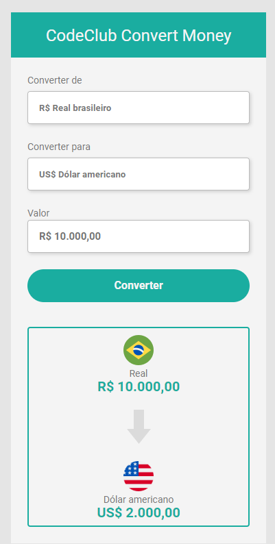

<h1 align="center">Conversor de Moedas 💰</h1>

 Projeto criado durante os módulos de JavaScript do <a target="_blank" href="https://rodolfomori.com.br/devclub/">DevClub</a>  .

 

## 🚀 Tecnologias

Esse projeto foi desenvolvido com as seguintes tecnologias:

- HTML e CSS
- JavaScript

## 💻 Projeto

Conversor de Moedas: 
- Real brasileiro 💲
- US$ Dólar americano 💵
- € Euro 💶
- ฿ Bitcoin 
## 👨🏻‍💻 Deploy

<a target="_blank" href="https://convertmoney-kauamath.netlify.app/"><b>CLICK PARA ACESSAR!</b></a>

## 🌎<i>Onde me encontrar:</i>  

  
   
  

